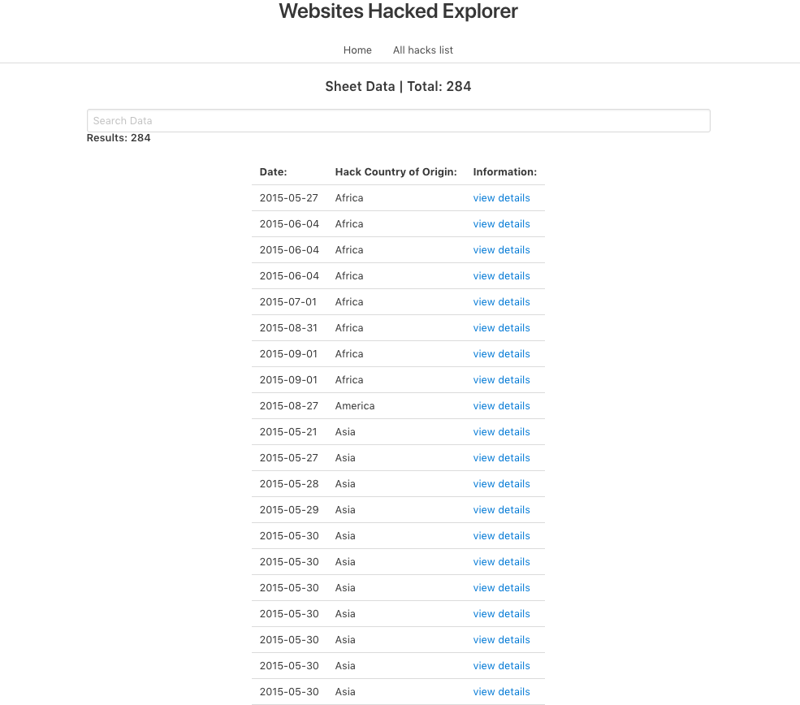
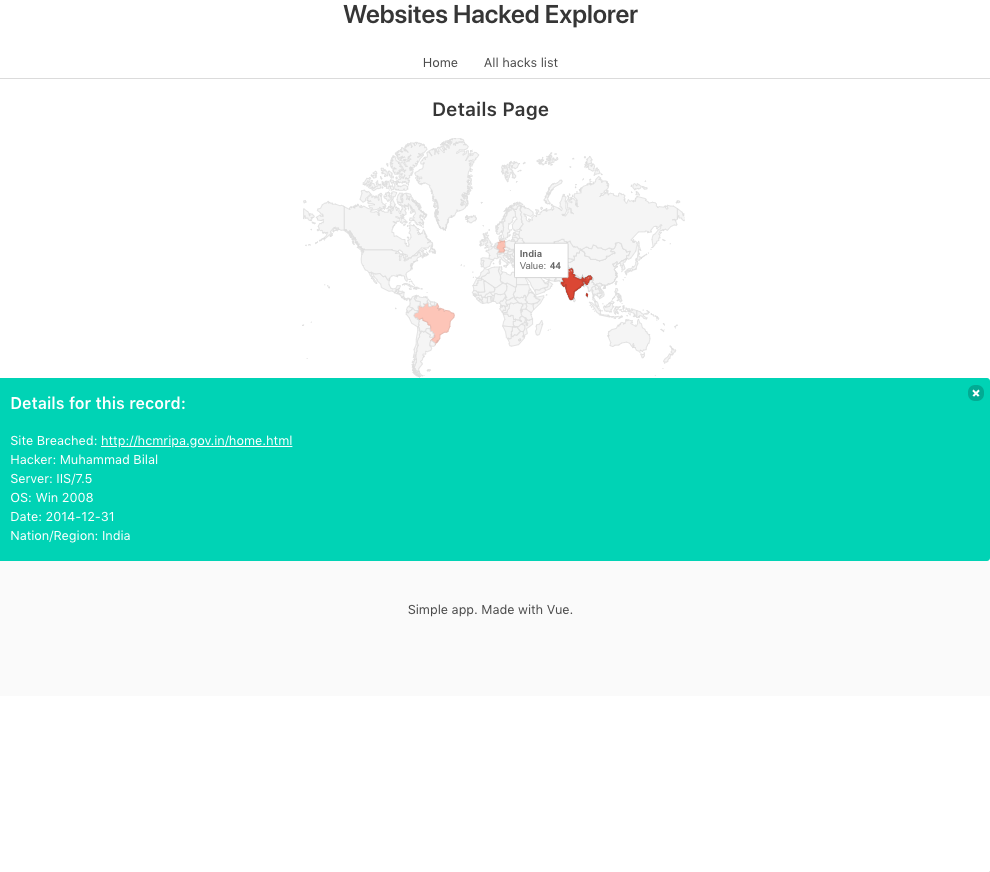

# Vue Sheets
#### A simple app using Vue.js, Vue-router, Axios and Vue charts.js to read and display data about hacked websites. Styled with Bulma. 
This is a simple application that reads json data, then displays each item in a searchable list, then allows you to view details about each 
data breach and see it on a map. Still working on it. 




> A Vue.js project

## Build Setup

``` bash
# install dependencies
npm install

# serve with hot reload at localhost:8080
npm run dev

# build for production with minification
npm run build
```

For detailed explanation on how things work, consult the [docs for vue-loader](http://vuejs.github.io/vue-loader).
